# Azure && Cloud Computing

## Day-1

### Cloud

- Cloud computing is a severless computing
- it is a pay as you go service.
- 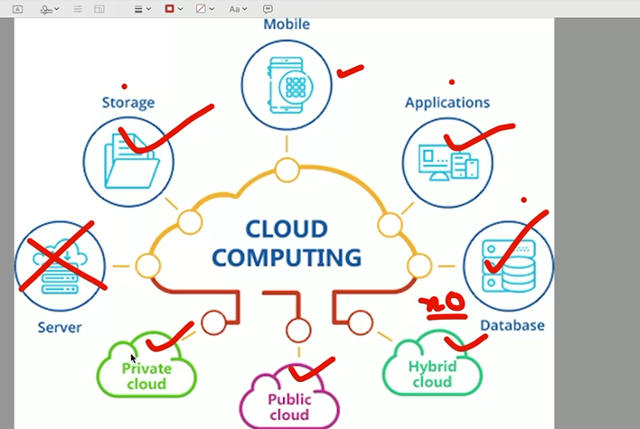
- the applications of the cloud computing like netflix,amazon..etc
- Cloud uses NOSQL database.
- private cloud means the cloud which we take the subscription.
- the passwords are stored in the cloud but in the special combination called encryption and decryiption.

### SAAS

- 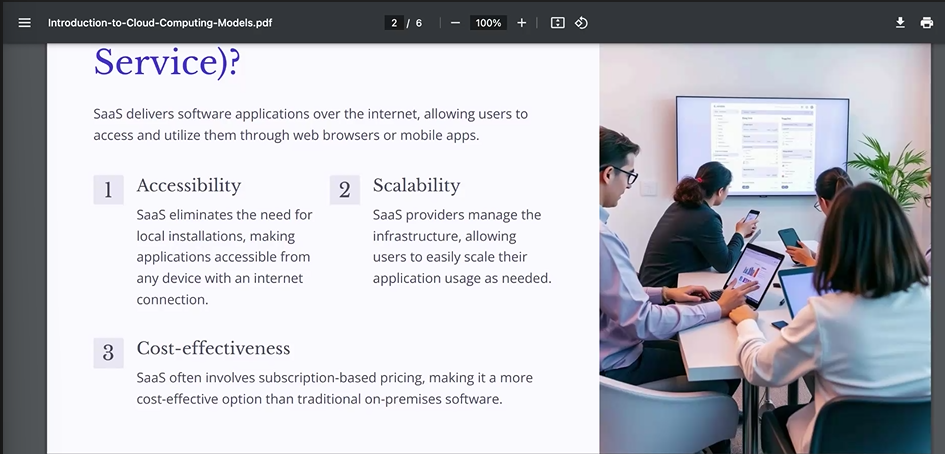
- Saas delivers Software applicaitons over the internet,allowing users to access and utilize them web browsers or mobile apps.
- Scaling : the group and the project we will be working is
  autoscaling group(asg).
- in the Active directory all the usernames and the passwords are stored .
- in SaaS the level of restriction is more than compared to other services.
- 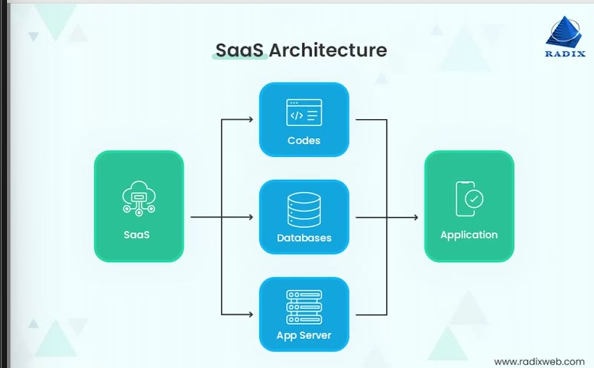

## IaaS

- 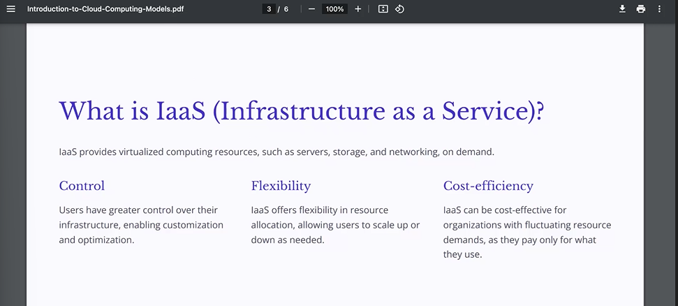
- we have much flexibility in the IaaS because we have much control over the infrastructure.

## PaaS

- 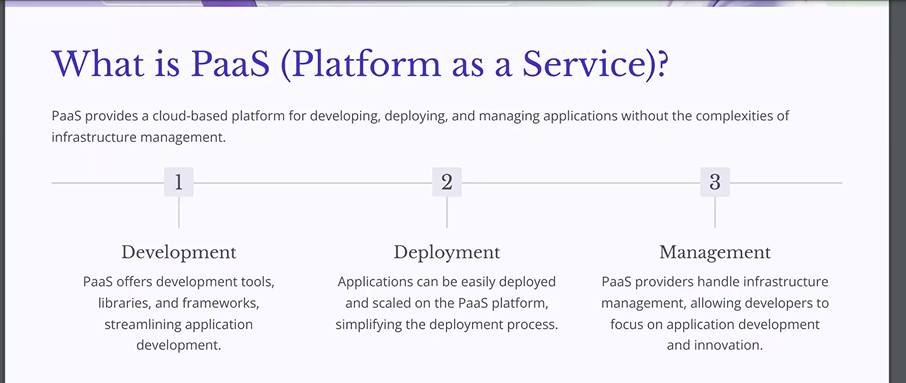
- it is b/w IaaS and SaaS
- PaaS provides the services like development.deployment and managing.
- 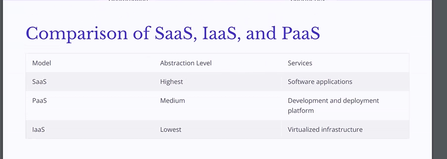
- the abstraction for the Saas is high because we don't know how the application is build
- the application is considered as complex if it has variety of the users like there are much users and there are users accessing from the differet locatio and at a same time the user may click same button which says that the application is complex
- the constraints like
  - number of users
  - turn around time(TAT)
  - Storage
- Example is Meta i.e facebook
- 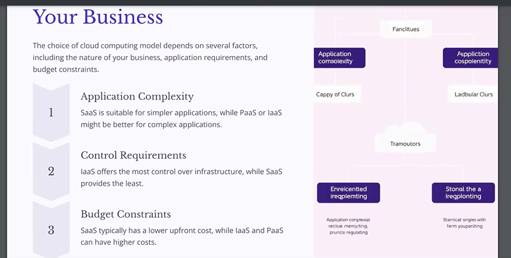
- serverless,deployment,application ,behaviour,infrastructure are the main constriants to categorize an application into Iaas,Paas,Saas
- the printer is a serverless and it is not a deployed , it is an application so it is a SaaS.

### Azure

- it is a cloud platform offering wide range of services, from compute and storage to networking.
- Azure Service :
  - 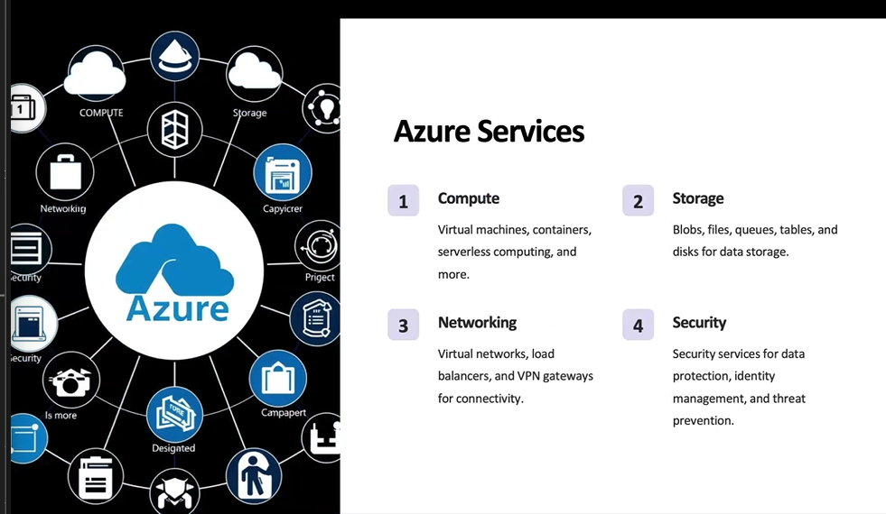
- Compute :
- VM,containers,serverless computing
- computation means how fast we can achieve the results.
- compute is process used for running the application,execute the process
- containers has the dependencies where ever we install it we can use that resources.

### Azure compute :

- 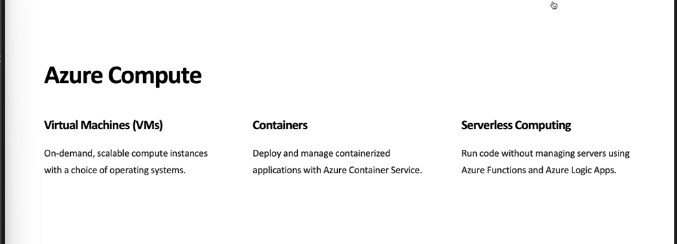
- VMs,Containers,ServerlessComputing

1. Virtual Machines(VMs)

- On-demand means whenever needed,we can perform scaling

2.  containers deploy and managae containerized applications with azure container service.

- azure has its own container service in which we don't need to worry everything is managed by the azure.

### Azure Storage:

- 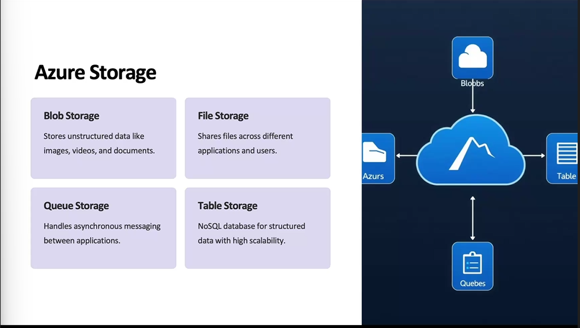
- Blob storage,filestorage,queue Storage,Table Storage.

### Azure Networking:

- 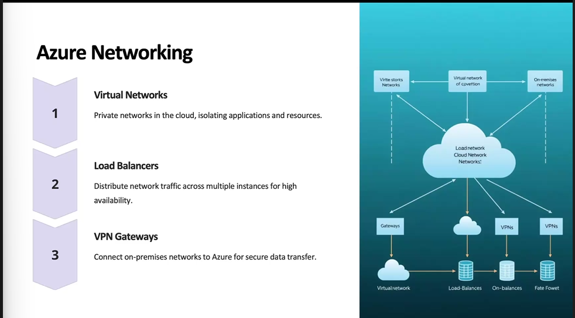
- if we want to pass the data through the network we use this VPN gateways.
- Virtual network,load balancers
- virtual network is a private cloud network

### Azure Security:

- Identity management - Azure will maintain the identity by using this identity manaagment service in which it will perform the authentication and the authorzation.
- based on the roles like developer , tester,deployment those are only visible and can be usable to that identity this is managed by the admin i.e azure team
- authentication means validating only the user name and the password.
- in authorization it will decide what resources can be accessed
- 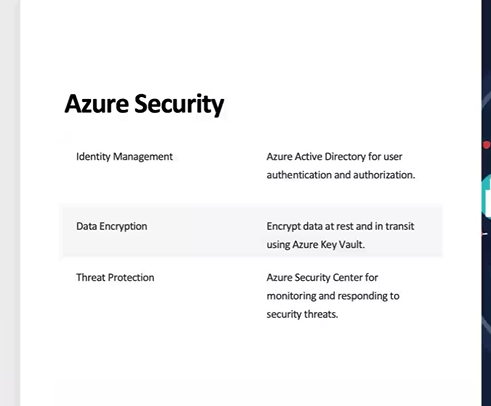

### Azure monitoring:

- Log analysis,Metrics,Alerts
- 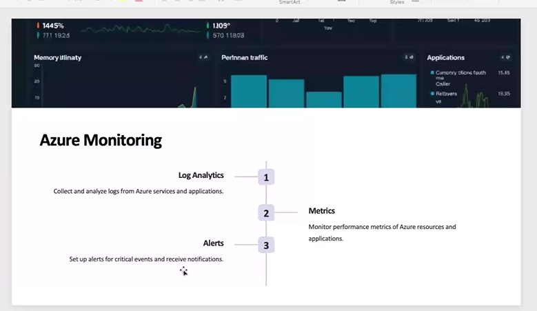
- we don't interfear in this we just utilize it.

# Day-2

### Azure WebJob

- the web jobs will automate the tasks in background . it is a convenient way to execute code on a schedule or in response to certain triggers,without having to manage seperate infrsatructure.
- Web jobs is used for tracking the tasks performed by the user they will not intimate the user but at the end of the month it will gives the bill.
- it a background task run by the azure
- 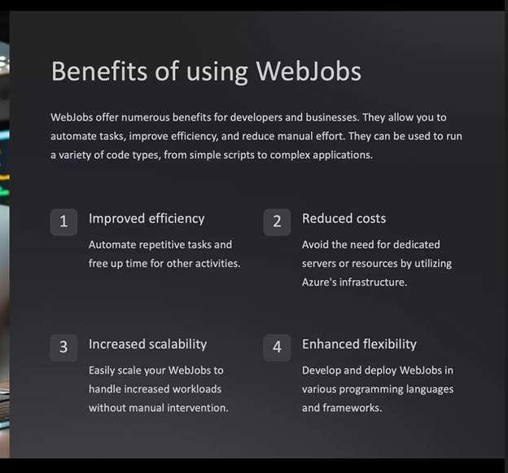
- bill is generated with the help of the azure webjob because it will continusly moniter the users actions.
- 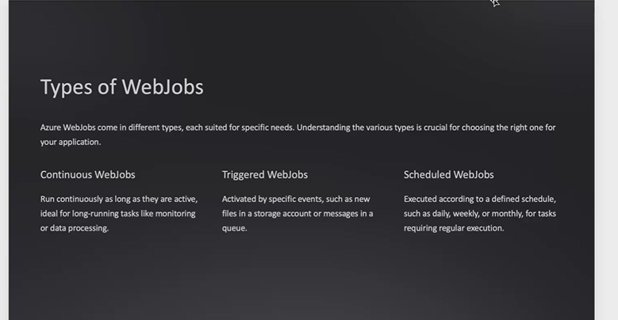
- 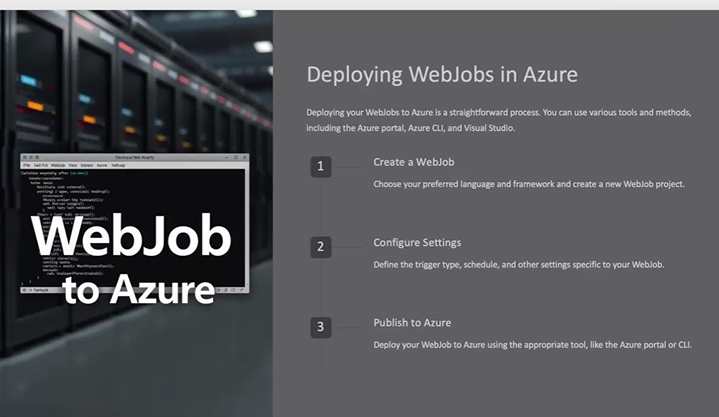
- 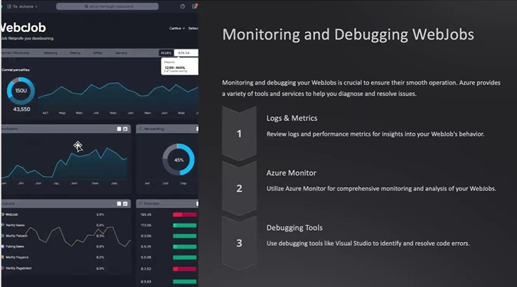
- 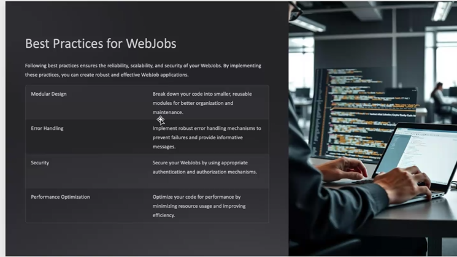

## Containers

- 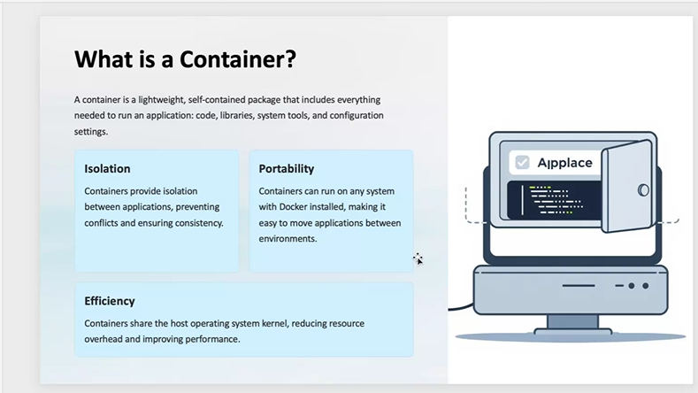
- the packages has the code ,libraries, and all the dependencies to run a project those all are present and is stored in the containers to save the time .
- the three pillers of the containers are
  - isolation
  - portability
  - Efficency

#### Benfits of the containerization

- 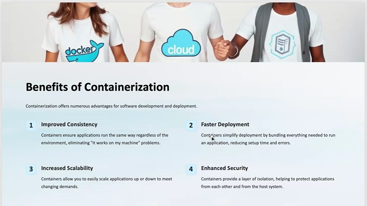

## Docker(in depth)

- 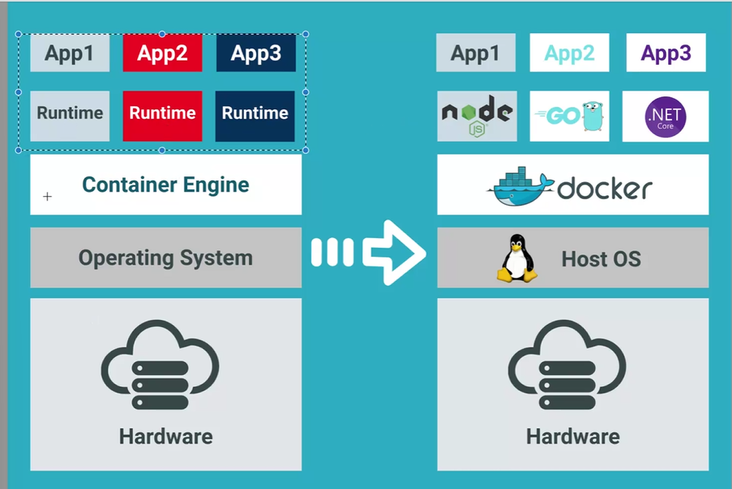
- for deploying purpose we use the dockers
- it a container engine
- 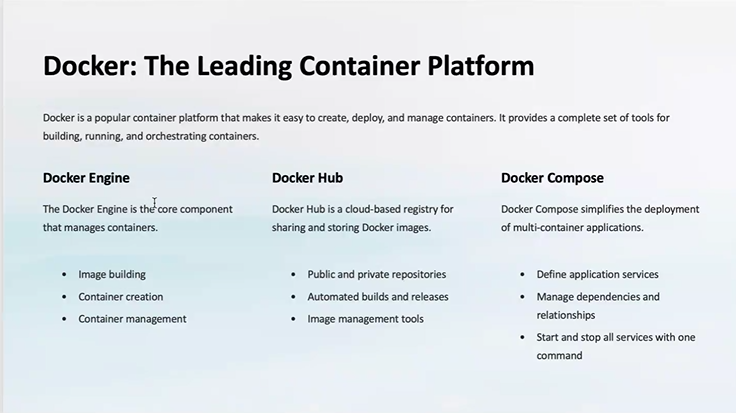
- 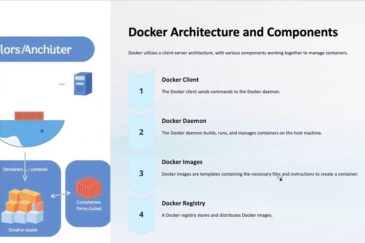
- the commands used to run the docker is called the docker client
- docker daemon : it will take lot of space it builds,runs and manages the containers.
- docker registers have multiple images.

### Building the docker images

- 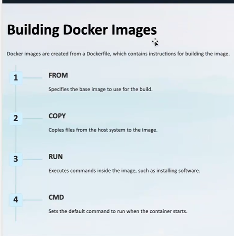
- Azure resource manager(ARM)- means azure has many resources this is managed by the arm.
- API : google maps is an api and that api can be used by the many applications like swiggy,zomato

### Azure Function app

- used to
- Scale behaviuor :what factor determine when to increase and when to decrease

# Day-3

- Shared responsibility model i.e cloud is a shared responsibility model
- both parties i.e cloud and the client shared there tasks and manage the applications to maintain the application.
- first the azure developer will checks the availability zone if the application is not working properly.
- Data centre takes care of properly maintaning the data like customer should has the availability of the data in simple terms it is called as towers i.e the availability zone.
- the advantage of the azure server is one server can manage multiple clients by using networking.
- one availability zone can have one or more data centers based on the usage and number users.
- resources are database,programming langauge,frontend,server,virtual machine are called resources.
- services means which are we going to use.
- 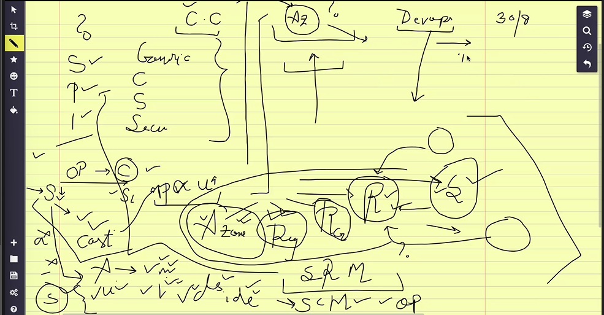

#### Devops

- developer operations (Devops)
- in main branch we keep our main code which is flawless and error free and accurate code we push the code into the main branch only after the code is 100% accurate
- the developer will not push the code directly
- SCM(source code managment tool)
- dev,test,prod are the three main branches in the git.
- pull request is used to push the code from one branch to the another branch
- the main function of devops engineer is to
- pipline means one after the other step
- but now it is done automate called ci/cd pipline
- the cloud will sink all the sub branches to the main branch automatically (ci/cd pipline).
- trigerrs are the stimulations ie signals will sent to the devops then deployment is done
- the devops eng will get a mail by saying deployment triggered then the devops eng will accept it then the cloud will perform the piplining and then it is deployed.
- the branches are should be in sink if we want to perform the pipling
- after sinking we should delete the branches after sinking is performed because it may cause disturbance in the pipling
- for automation purpose we put the code in the vms so that it can able to identify which code is present where and where to pick the code so that we place the code in the vms for automation deployment.
- database is a resources by using it we can create the services
- 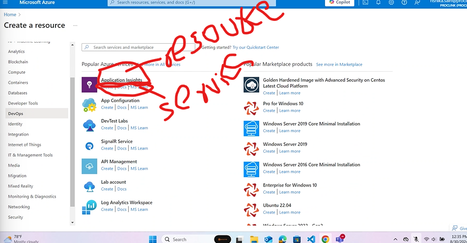

#### Facotrs for choosing azure region

- 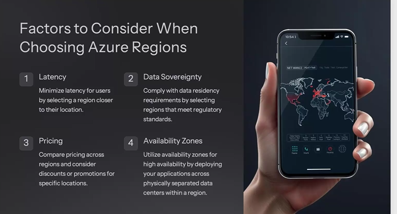
- lantency :(delay) if you are using a service and it is taking time to provide the service called latency
- low latency delay means less delay it is considered. instead of re installing just resuing is performed
- Region Optimization:
  - Geo-replication : replicate data across multiple regions to ensure availability and disaster recovery.
  - Traffic Routing : utilize azure traffic manager to distribute traffic to the optimal region based on performance and avaiability
  - Azure Content delivery network(CDN): cache content closer to end-user for faster delivery,improving performance and reduce latency.

### ARM

- 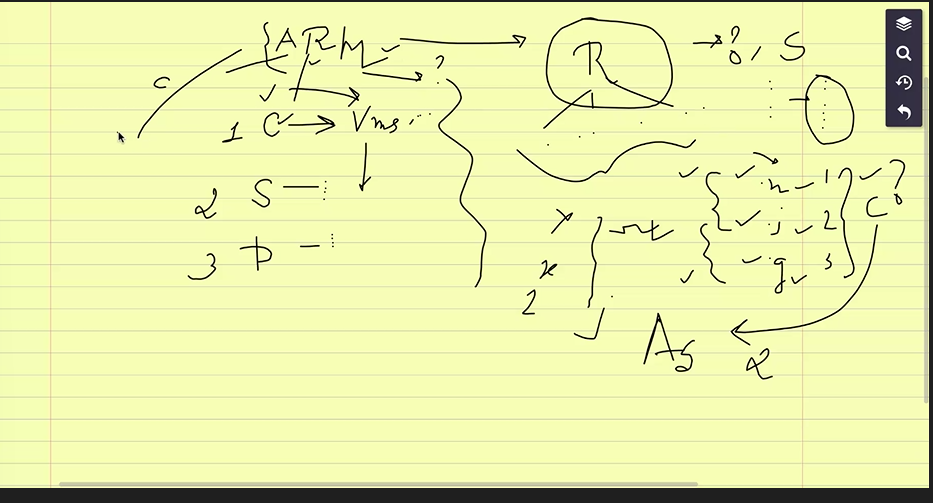

### Micro services:

- instead of creating one instance create small small instance and deploy each of it.
- 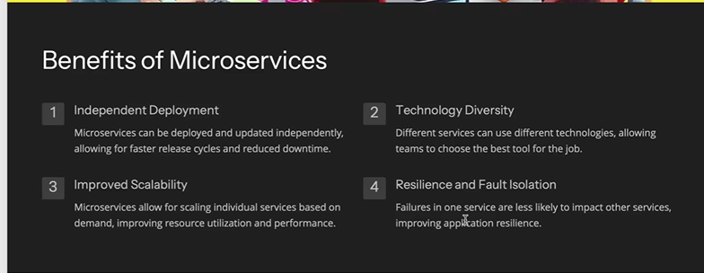
- independent deployment : means multiple containers
- even if one of the services is failed then it should not affect others

#### Challenges in the microservices:

- 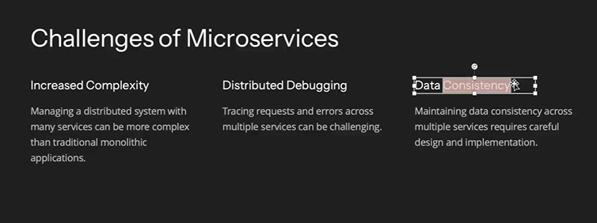

#### Microservice Architecture :

- 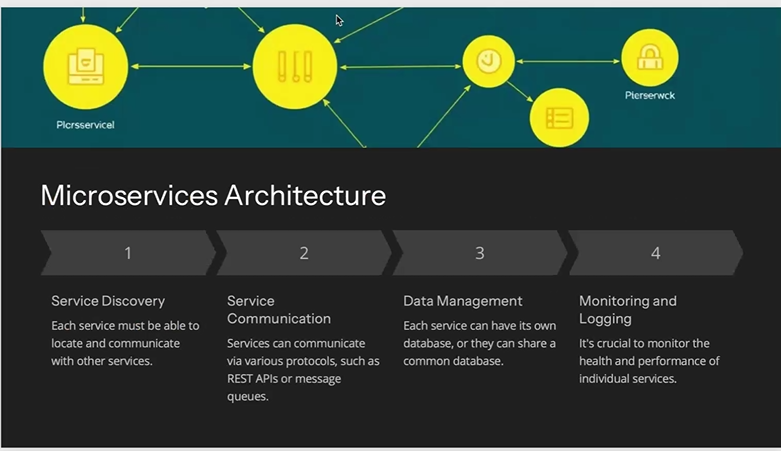

# Day-4

## SOLID principles

- 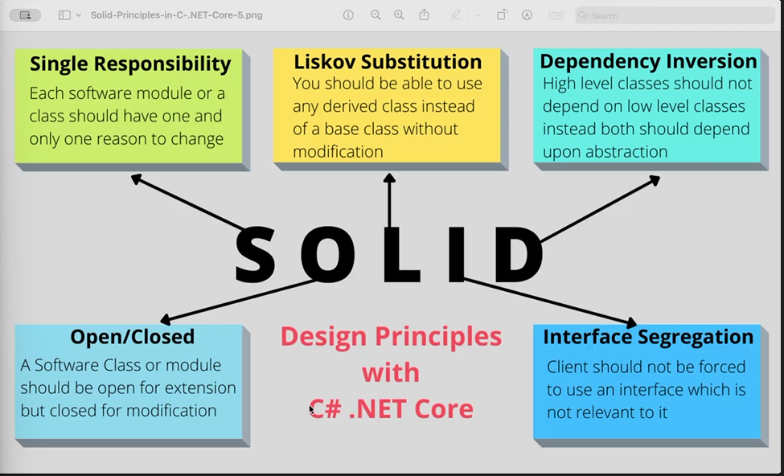
- Open/Closed : the parent class should has minimum code like basic code which is useful for inherited classes
- the parent class should not be modifed because that parent class is accessed by the many child classes
- Liskov Substitution :
  - we Substituting the sub class so that without changing the parent class we can use it.
- 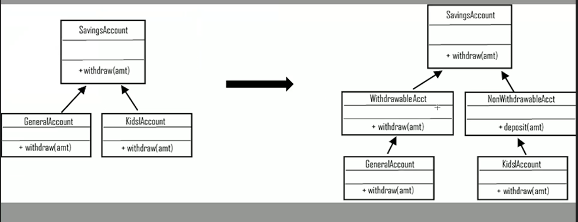
- Interface segregation : only use the clients required interface not the other interface similar to the pay as you go.
  - it removes the concept of multiple inheritance
- Depenedency Inversion : the classes i.e parent class should not depened on the child class instead both should depend on the abstraction
- abstraction in this situation is hiding
- agile means part by part.
- 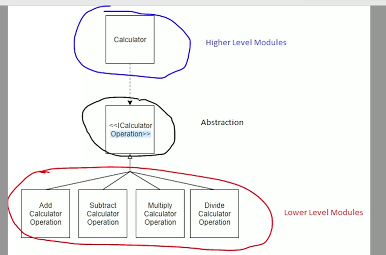

#### Backlog

- backlogs means we creates a task which is performed in the future but not by us.
- we create a list of task for a sprint intially and our manager will ask to work behalf of him

##### Azure repos

- 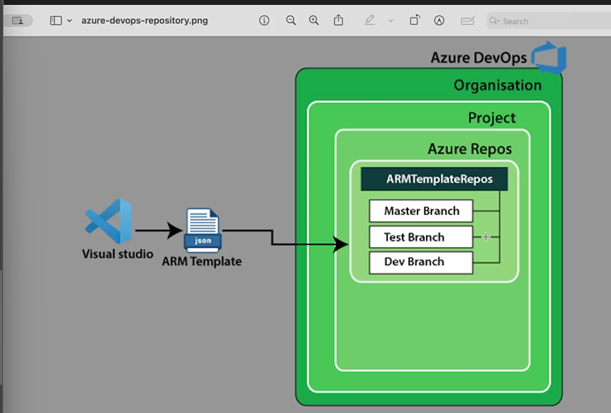
- 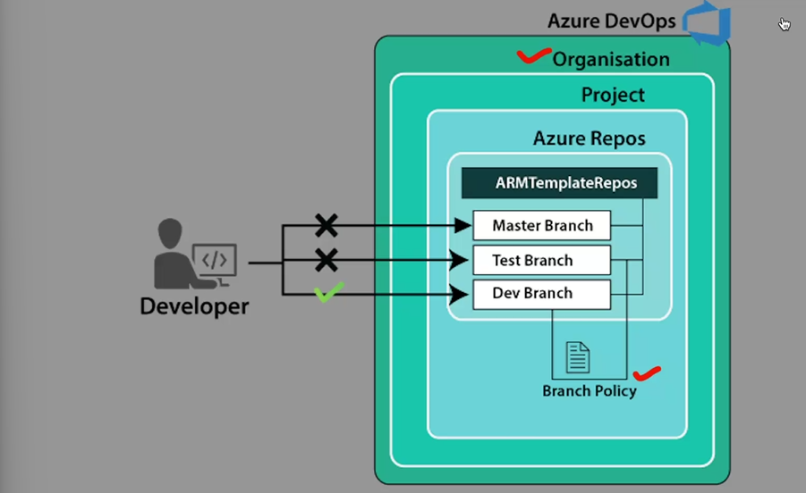

## Kubernetes(K8s)

- at a time kubernete can manage 8 and multiples of 8 open source containers.
- it is a process of managing the containers i.e called orechrestration.
- it automates the deployment, scaling and managing the java , dotnet and other lanaguages single project is managed using the containers and thos containers are been managed by the the kubernetes.
- 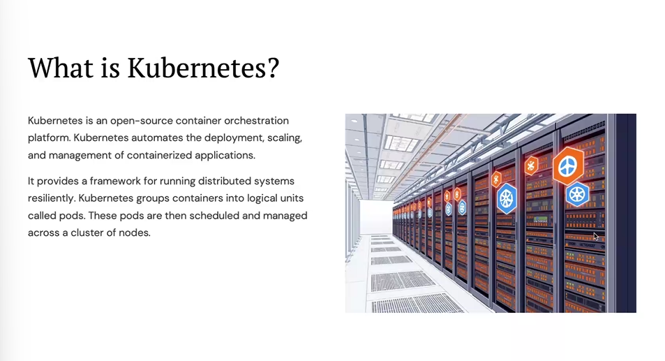
- pods is equal to units .
- scheduling the pods to run at a particular time is called the cluster nodes.
- 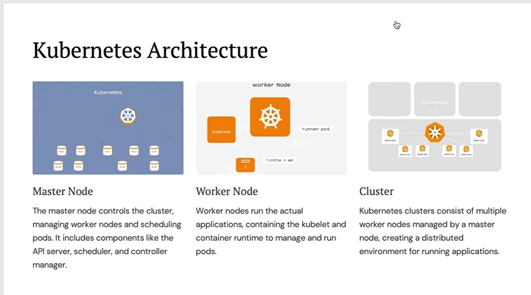
- 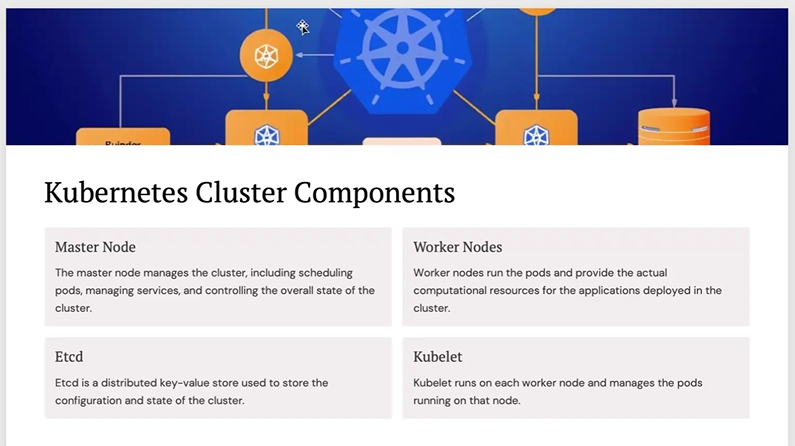
- 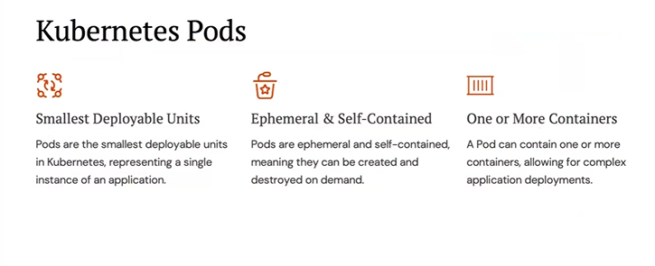

#### Commands for creation of resource group and containers

- az group create --name myapp-rg --location eastus
- az acr create --resource-group myapp-rg --name mycontainerregistry --sku Basic
- az aks install-cli // to install the cluster

#### intro of kubernetes

- https://kubernetes.io/

#### link to create a cluster

- https://learn.microsoft.com/en-us/azure/aks/tutorial-kubernetes-deploy-cluster?tabs=azure-cli

- 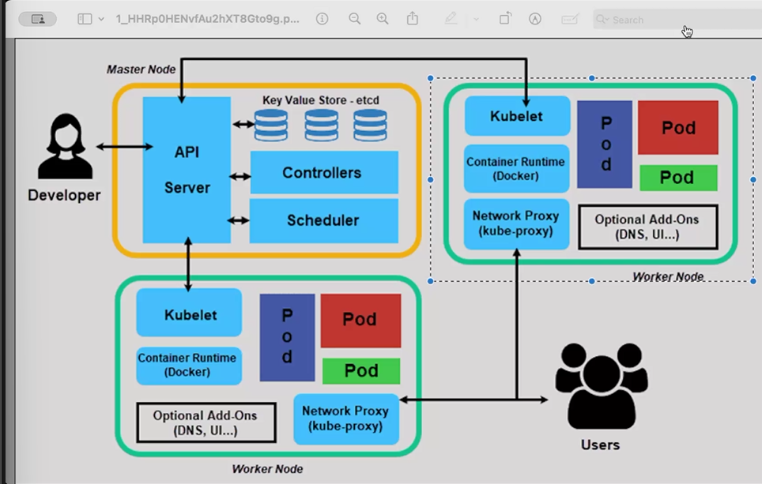

#### Kubernetes deployment

- 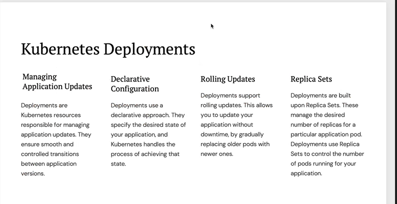
- updating the deployment is possible the by kubermetes by replacing the old pods with the new pods .

#### kubernetes services

- 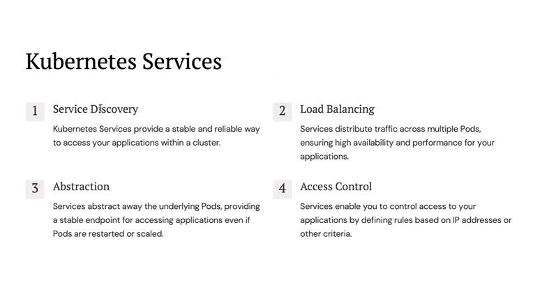
- are responsible for running a applications within a pods

### Kubernetes Networking

- 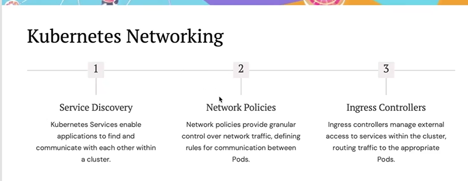
- network policies :helps us to control the communication b/w the pods
- 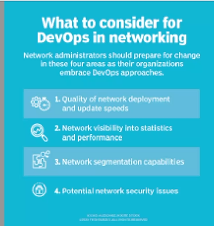
- first we create a container then the next step is to create a container registry i.e a key value pair then the next step is to perform the orcestration i.e those multiple containers are to be organized i.e kubernetes.
- C ➡️ CR ➡️ O
- 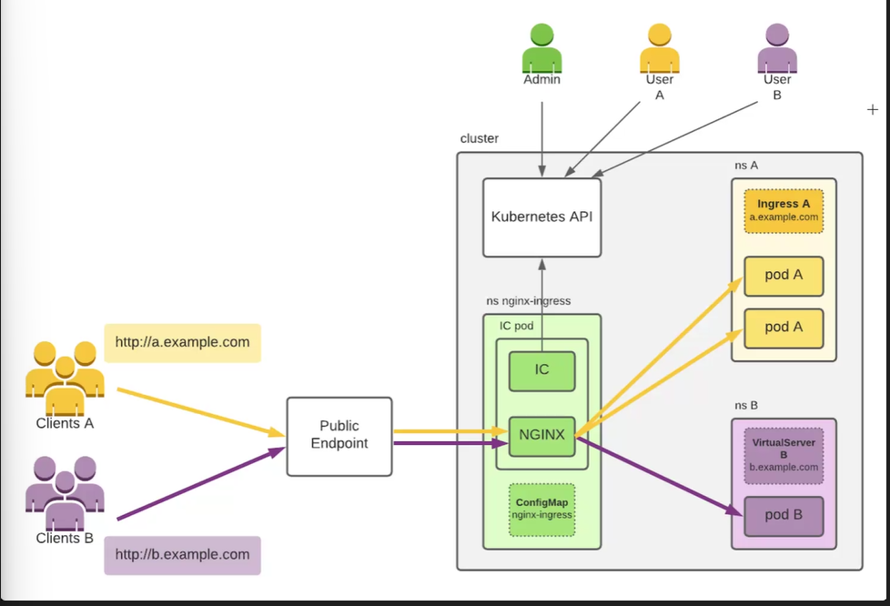
- 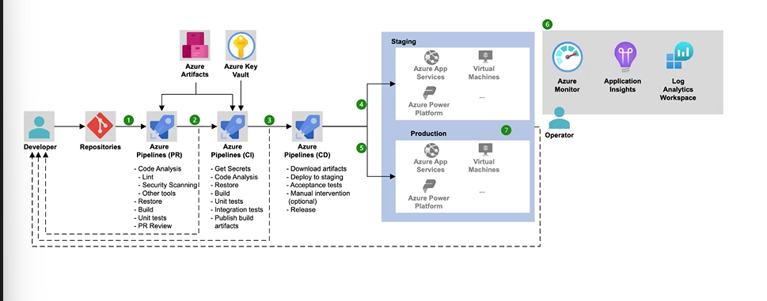
- in master node we have all the deployment information ,controller schedulars for job where developer interact with it directly inorder make the application work the master node is required and this node will handles the worker node.
- the worker node will refers the master node.
- kubernates it cannot replace the code , database it doe'nt replace the devops operations it only helps in managing the deployment.
- endpoints means the network address.

# Day-5

- the docker in the worker node will identify the containers
- containerization will maintains containers and its count for a similar microservice it maintain one container and clone it to the multiple systems.
- kublet is a process that runs in background while we using the kubernetes.
- 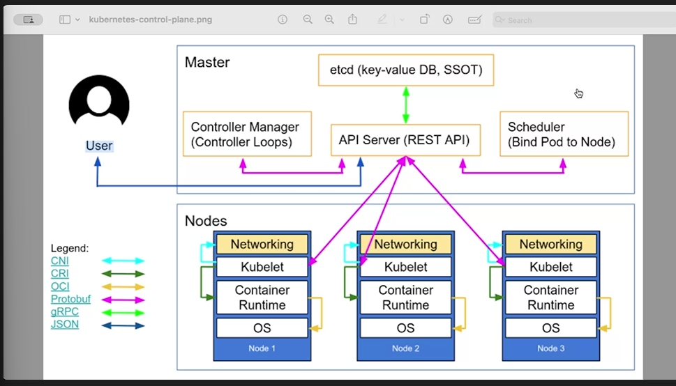
- 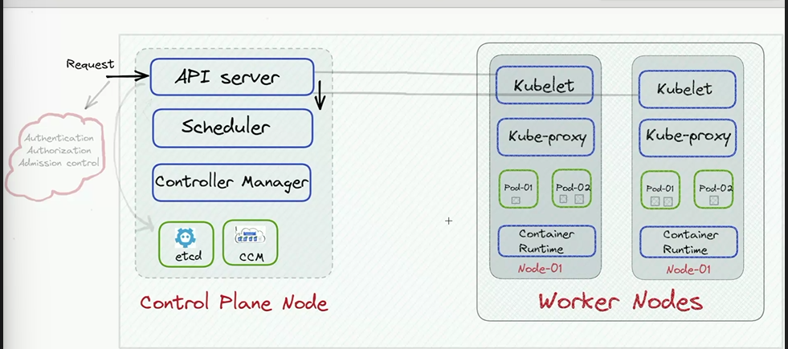
- master node is also called control plane node
- 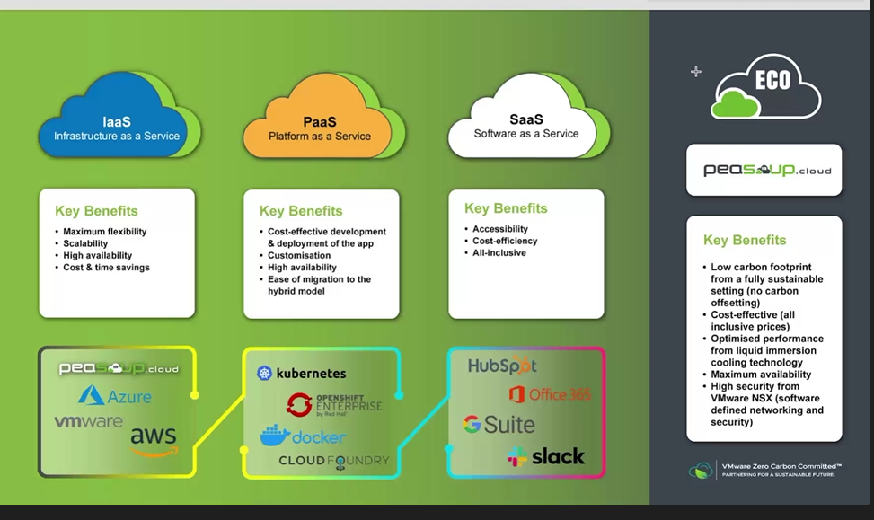
- 
- every microservice will works on a cluster.
- 
- the combiantion of nodes is called replica set which
- the worker nodes are dependent on each other for deploying we need the commbined worker nodes to work together we us a replica set.
- 
- name space means address given to an application.
- 
- given a unique name for the purpose of deployment
- 
- only one single insatance from each node will be stored in a set and helps to run at a time is called daemon set
- 

#### Controller manager

- 
- will have all the access to the all respective managers
- control the internal mechanism by virtue of it the kubernete will execute.
- 
- how aks is using a particular cloud and the particular sevices is called ingress.
- interally progressing a service is called ingress.
- 
- ingress will decide which particular application uses which services at a particular time.

# Day-6

### Ingress

- 
- ingress will manages the reqest of the users and routes the requests to the appropirate services.
  ingestion is done by the ingress.
- 
- 
- epic is a high level task means which is itself is not compelete it is a management.
- tasks are techical. stories are a bit less techincal.
- [text](https://teams.microsoft.com/l/message/19:meeting_YWU5ZDBiN2YtMGRiMC00MzRiLTgxNzktMDQ3ZDI3NDM0N2Ez@thread.v2/1725528463757?context=%7B%22contextType%22%3A%22chat%22%7D)
- 
- 
- 

#### kubernetes scaling

- 
- manual is mainly for cpu
- 
- rollback is happend if the deployment has the problems

#### Kubernetes Monitering

- 
- grafana is the major tool used for moniter the kubernetes.

#### kubernetes security

- 
- kubernetes fleet manager will deploys multiple kubernetes clusters at a time.
-
